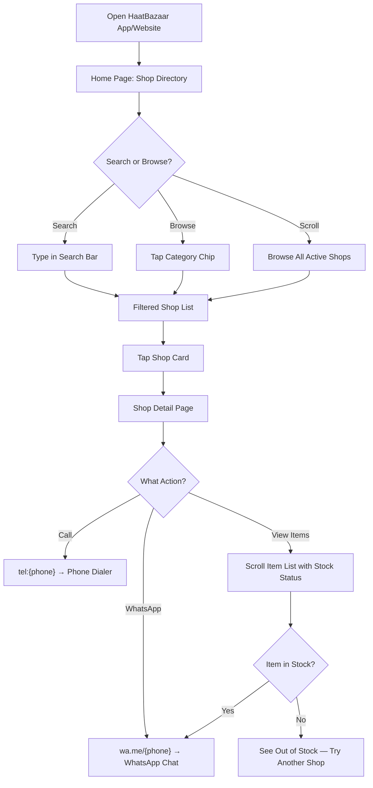
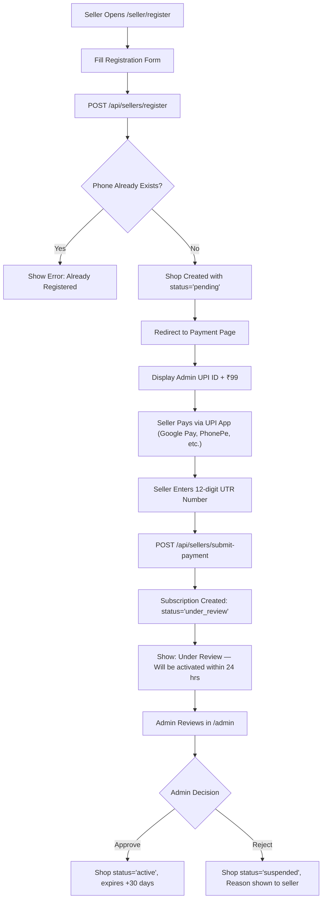
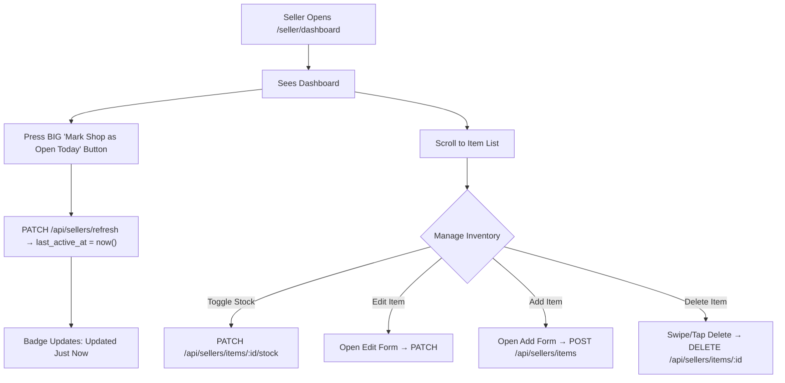
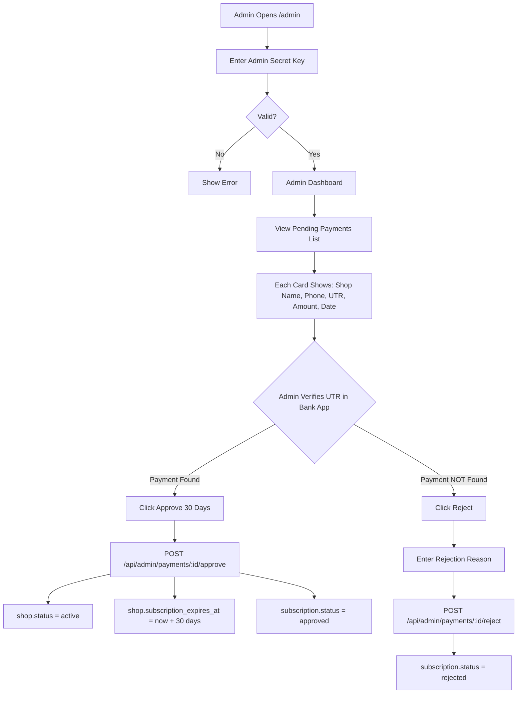

# HaatBazaar — Complete Design & Implementation Document

> **Version:** 1.0  
> **Date:** 2026-09-13  
> **Working Name:** HaatBazaar  
> **Tagline:** _"Your Village Market, In Your Pocket"_  
> **Goal:** 100% free-tier, multiplatform (Web + Android), edge-first hyper-local market discovery app.

---

## Table of Contents

1. [Executive Summary](#1-executive-summary)
2. [Architecture Overview](#2-architecture-overview)
3. [Tech Stack & Tooling](#3-tech-stack--tooling)
4. [Project File & Folder Structure](#4-project-file--folder-structure)
5. [Database Schema (Cloudflare D1 / SQLite)](#5-database-schema-cloudflare-d1--sqlite)
6. [API Contract (Hono on Cloudflare Pages Functions)](#6-api-contract-hono-on-cloudflare-pages-functions)
7. [Authentication & Authorization](#7-authentication--authorization)
8. [Frontend Pages & Components](#8-frontend-pages--components)
9. [UI/UX Design System](#9-uiux-design-system)
10. [Key Workflows (Customer / Seller / Admin)](#10-key-workflows-customer--seller--admin)
11. [Offline & PWA Strategy](#11-offline--pwa-strategy)
12. [Android APK Build (Capacitor)](#12-android-apk-build-capacitor--twa)
13. [Deployment & CI/CD (Cloudflare Pages)](#13-deployment--cicd-cloudflare-pages)
14. [Phase-by-Phase Implementation Plan](#14-phase-by-phase-implementation-plan)
15. [Environment Variables & Secrets](#15-environment-variables--secrets)
16. [Future Enhancements](#16-future-enhancements)
17. [Quick-Start Commands](#17-quick-start-commands)
18. [Implementation Constraints & Pitfalls](#18-implementation-constraints--pitfalls)

---

## 1. Executive Summary

HaatBazaar is a **zero-cost, lightweight hyper-local discovery platform** for rural markets (_haats_), small localities, and village commercial areas.

### What It Does

| Actor | Capability |
|---|---|
| **Customer** | Search shops by name/category/ward, view inventory with stock status & freshness timestamps, call or WhatsApp sellers directly. |
| **Seller** | Register shop, pay subscription via UPI (₹99/month or configurable), manage daily inventory with one-tap "I'm open today" button, toggle item stock status. |
| **Super Admin** | Access hidden `/admin` route, verify UPI payments by UTR reference, approve/reject/suspend shop listings. |

### Core Constraints

- **₹0 hosting cost** — everything runs on Cloudflare free tier.
- **No payment gateway integration** — sellers pay via standard UPI apps, paste UTR reference number; admin verifies manually.
- **No third-party auth service** — simple phone + PIN login with JWT, stored in localStorage.
- **Works on 2G/spotty networks** — offline caching of shop listings, minimal JS bundle.

---

## 2. Architecture Overview

```
┌──────────────────────────────────────────────────────────────────┐
│                      CLOUDFLARE ECOSYSTEM                        │
│                                                                  │
│  ┌──────────────────────────────────────────────────────────┐    │
│  │          Cloudflare Pages (Static + Functions)            │    │
│  │                                                          │    │
│  │  ┌─────────────────┐    ┌─────────────────────────────┐  │    │
│  │  │  Static Assets   │    │  Pages Functions (Edge API)  │  │    │
│  │  │  (React/Vite)    │    │  Hono Router                 │  │    │
│  │  │                  │    │                               │  │    │
│  │  │  /index.html     │    │  /api/shops                  │  │    │
│  │  │  /assets/*       │    │  /api/shops/:id/items        │  │    │
│  │  │  /seller/*       │    │  /api/sellers/*              │  │    │
│  │  │  /admin/*        │    │  /api/admin/*                │  │    │
│  │  └─────────────────┘    └──────────┬──────────────────┘  │    │
│  │                                     │                     │    │
│  └─────────────────────────────────────┼─────────────────────┘    │
│                                        │                          │
│                                        ▼                          │
│                            ┌──────────────────────┐               │
│                            │  Cloudflare D1       │               │
│                            │  (SQLite Database)   │               │
│                            │                      │               │
│                            │  shops               │               │
│                            │  items               │               │
│                            │  subscriptions       │               │
│                            │  seller_sessions     │               │
│                            └──────────────────────┘               │
│                                                                   │
│                            ┌──────────────────────┐               │
│                            │  Cloudflare R2       │  (Future)     │
│                            │  (Image Storage)     │               │
│                            └──────────────────────┘               │
└───────────────────────────────────────────────────────────────────┘

         ▲                    ▲                    ▲
         │                    │                    │
    ┌────┴────┐         ┌────┴────┐         ┌────┴────┐
    │ Android │         │   Web   │         │  Admin  │
    │   App   │         │ Browser │         │  (Web)  │
    │(PWA/APK)│         │Customer │         │ /admin  │
    └─────────┘         └─────────┘         └─────────┘
```

### Request Flow

1. Client (browser or Android app) makes a request to `haatbazaar.pages.dev` (or custom domain).
2. Cloudflare Pages serves static HTML/JS/CSS for the frontend.
3. Any `/api/*` request is routed to **Pages Functions** which run on Cloudflare Workers (edge).
4. Pages Functions use **Hono** as the router framework. Each handler reads/writes to **Cloudflare D1**.
5. Response is returned to the client as JSON.

---

## 3. Tech Stack & Tooling

| Layer | Technology | Why |
|---|---|---|
| **Frontend Framework** | React 18+ (via Vite) | Fast builds, huge ecosystem, easy Capacitor integration |
| **CSS** | Tailwind CSS v3 | Utility-first, small bundle with purge, rapid prototyping |
| **Icons** | Lucide React | Lightweight, tree-shakable, modern icon set |
| **Routing (Client)** | React Router v6 | Standard SPA routing, supports `/seller/*` and `/admin/*` sections |
| **Backend Framework** | Hono v4 | Ultra-light (14KB), edge-native, built for Cloudflare Workers |
| **Database** | Cloudflare D1 (SQLite) | Free tier: 5M reads/day, 100K writes/day, 5GB storage |
| **Image Storage** | Cloudflare R2 _(future)_ | 10GB free, zero egress |
| **Auth (Seller)** | Phone + PIN → JWT in localStorage | Zero cost, no SMS API needed initially (PIN-based) |
| **Auth (Admin)** | Static secret token in env var | Simple, secure enough for single admin |
| **Build Tool** | Vite 5 | Fastest React build tooling |
| **Deployment** | Cloudflare Pages (Git integration) | Auto-deploy on push, free SSL, global CDN |
| **Android Packaging** | Capacitor v5+ | Wraps web app into native Android APK/AAB, uses Android Studio |
| **Package Manager** | npm | Standard, universal |
| **CLI** | Wrangler v3 (Cloudflare CLI) | Local dev, D1 management, deployment |

### Free Tier Limits (Cloudflare)

| Resource | Free Tier Limit | HaatBazaar Estimated Usage |
|---|---|---|
| Pages Deployments | 500/month | ~30/month |
| Workers Requests | 100,000/day | ~5,000/day (early stage) |
| D1 Read Rows | 5,000,000/day | ~50,000/day |
| D1 Write Rows | 100,000/day | ~2,000/day |
| D1 Storage | 5 GB | < 100 MB (early stage) |
| R2 Storage | 10 GB | < 1 GB (future images) |

---

## 4. Project File & Folder Structure

```
HaatBazaar/
├── .github/                        # (Optional) GitHub Actions if needed
│
├── functions/                      # Cloudflare Pages Functions (serverless API)
│   └── api/
│       └── [[route]].ts            # Catch-all route → Hono handles all /api/*
│
├── src/                            # React frontend source
│   ├── main.jsx                    # React entry point
│   ├── App.jsx                     # Root component with React Router
│   │
│   ├── components/                 # Shared/reusable UI components
│   │   ├── Layout.jsx              # App shell (header, nav, footer)
│   │   ├── SearchBar.jsx           # Sticky search input
│   │   ├── ShopCard.jsx            # Shop listing card
│   │   ├── ItemRow.jsx             # Single item row (name, price, stock badge)
│   │   ├── StockBadge.jsx          # Green/Red stock indicator
│   │   ├── FreshnessBadge.jsx      # "Updated Today" / "2 days ago" badge
│   │   ├── CategoryFilter.jsx     # Horizontal scrollable category chips
│   │   ├── CallWhatsAppButtons.jsx # Direct action buttons
│   │   ├── ProtectedRoute.jsx     # Auth guard for seller/admin routes
│   │   ├── LoadingSpinner.jsx     # Loading state component
│   │   └── EmptyState.jsx         # "No results" illustration
│   │
│   ├── pages/                      # Route-level page components
│   │   ├── customer/
│   │   │   ├── HomePage.jsx        # Shop directory + search + category filter
│   │   │   └── ShopDetailPage.jsx  # Single shop: items list + call/WA buttons
│   │   │
│   │   ├── seller/
│   │   │   ├── SellerLoginPage.jsx     # Phone + PIN login
│   │   │   ├── SellerRegisterPage.jsx  # Registration form
│   │   │   ├── SellerPaymentPage.jsx   # UPI intent + UTR input
│   │   │   ├── SellerDashboard.jsx     # Daily management: refresh + inventory
│   │   │   └── SellerItemForm.jsx      # Add/Edit item modal or page
│   │   │
│   │   └── admin/
│   │       ├── AdminLoginPage.jsx      # Secret key login
│   │       ├── AdminDashboard.jsx      # All shops overview + pending payments
│   │       └── AdminPaymentReview.jsx  # UTR approval/rejection
│   │
│   ├── hooks/                      # Custom React hooks
│   │   ├── useShops.js             # Fetch & cache shop listings
│   │   ├── useShopItems.js         # Fetch items for a shop
│   │   ├── useSellerAuth.js        # Seller authentication state
│   │   ├── useAdminAuth.js         # Admin authentication state
│   │   └── useOfflineCache.js      # IndexedDB/localStorage caching
│   │
│   ├── lib/                        # Utility functions
│   │   ├── api.js                  # Centralized fetch wrapper (base URL, headers, error handling)
│   │   ├── auth.js                 # JWT encode/decode helpers, token storage
│   │   ├── formatters.js           # Price formatting, date relative strings
│   │   ├── constants.js            # Category list, status enums, config
│   │   └── offlineStore.js         # IndexedDB wrapper for offline caching
│   │
│   └── styles/
│       └── index.css               # Tailwind directives + custom CSS variables
│
├── public/                         # Static public assets
│   ├── favicon.ico
│   ├── logo.svg                    # HaatBazaar logo
│   ├── manifest.json               # PWA manifest
│   ├── sw.js                       # Service Worker (offline support)
│   └── icons/                      # PWA icons (192x192, 512x512)
│
├── db/                             # Database migration files
│   ├── 0001_initial_schema.sql     # Tables: shops, items, subscriptions, seller_sessions
│   └── 0002_seed_data.sql          # (Optional) sample data for development
│
├── android/                        # Capacitor Android project (generated)
│   └── ...                         # Android Studio project files
│
├── index.html                      # Vite entry HTML
├── vite.config.js                  # Vite configuration
├── tailwind.config.js              # Tailwind configuration
├── postcss.config.js               # PostCSS (required by Tailwind)
├── wrangler.toml                   # Cloudflare Workers/Pages config (D1 binding)
├── capacitor.config.ts             # Capacitor config for Android build
├── package.json                    # Dependencies & scripts
├── tsconfig.json                   # TypeScript config (optional, can use JSX)
└── README.md                       # Developer quickstart guide
```

---

## 5. Database Schema (Cloudflare D1 / SQLite)

### File: `db/0001_initial_schema.sql`

```sql
-- =============================================================
-- HaatBazaar Database Schema v1.0
-- Target: Cloudflare D1 (SQLite)
-- =============================================================


-- ---------------------------------------------------------
-- SHOPS TABLE
-- Core entity: each row = one seller's shop listing.
-- ---------------------------------------------------------
CREATE TABLE IF NOT EXISTS shops (
    id TEXT PRIMARY KEY,                          -- UUID v4 (generated server-side)
    name TEXT NOT NULL,                           -- Shop display name ("Ramesh Kirana Store")
    owner_name TEXT NOT NULL,                     -- Owner's full name
    phone TEXT NOT NULL UNIQUE,                   -- 10-digit Indian mobile (unique per shop)
    pin_hash TEXT NOT NULL,                       -- SHA-256 hash of (pin + salt)
    pin_salt TEXT NOT NULL,                       -- Random 16-byte hex salt (generated at registration)
    category TEXT NOT NULL,                       -- Enum: see CATEGORIES constant
    hamlet_ward TEXT NOT NULL,                    -- Village/Ward name or number
    landmark TEXT,                                -- Nearby landmark for easy discovery
    upi_id TEXT,                                  -- Seller's own UPI ID (for customers, future use)
    status TEXT NOT NULL DEFAULT 'pending',        -- 'pending' | 'active' | 'suspended' | 'expired'
    subscription_expires_at TEXT,                 -- ISO 8601 datetime string
    last_active_at TEXT DEFAULT (datetime('now')),-- Last time seller pressed "I'm open today"
    created_at TEXT DEFAULT (datetime('now')),    -- Row creation timestamp
    updated_at TEXT DEFAULT (datetime('now'))     -- Last modification timestamp
);

-- Index for common queries
CREATE INDEX IF NOT EXISTS idx_shops_status ON shops(status);
CREATE INDEX IF NOT EXISTS idx_shops_category ON shops(category);
CREATE INDEX IF NOT EXISTS idx_shops_hamlet ON shops(hamlet_ward);
CREATE INDEX IF NOT EXISTS idx_shops_phone ON shops(phone);

-- ---------------------------------------------------------
-- ITEMS TABLE
-- Each row = one product/item listed by a shop.
-- ---------------------------------------------------------
CREATE TABLE IF NOT EXISTS items (
    id TEXT PRIMARY KEY,                          -- UUID v4
    shop_id TEXT NOT NULL,                        -- FK → shops.id
    name TEXT NOT NULL,                           -- Item display name ("Toor Dal", "Buffalo Calf")
    price REAL,                                   -- Price in INR (NULL = "Ask seller")
    unit TEXT,                                    -- Unit: 'kg', 'piece', 'liter', 'dozen', 'quintal', etc.
    is_in_stock INTEGER NOT NULL DEFAULT 1,       -- 1 = in stock, 0 = out of stock (SQLite boolean)
    sort_order INTEGER NOT NULL DEFAULT 0,        -- For manual ordering within shop
    last_stock_update TEXT DEFAULT (datetime('now')), -- When stock status last changed
    created_at TEXT DEFAULT (datetime('now')),
    updated_at TEXT DEFAULT (datetime('now')),
    FOREIGN KEY (shop_id) REFERENCES shops(id) ON DELETE CASCADE
);

CREATE INDEX IF NOT EXISTS idx_items_shop ON items(shop_id);
CREATE INDEX IF NOT EXISTS idx_items_stock ON items(is_in_stock);

-- ---------------------------------------------------------
-- SUBSCRIPTIONS TABLE
-- Payment ledger: each row = one UPI payment submission.
-- ---------------------------------------------------------
CREATE TABLE IF NOT EXISTS subscriptions (
    id TEXT PRIMARY KEY,                          -- UUID v4
    shop_id TEXT NOT NULL,                        -- FK → shops.id
    utr_number TEXT NOT NULL,                     -- 12-digit UPI Transaction Reference
    amount REAL NOT NULL,                         -- Amount in INR (e.g., 99.00)
    screenshot_url TEXT,                          -- (Future) R2 URL of payment screenshot
    submitted_at TEXT DEFAULT (datetime('now')),  -- When seller submitted the UTR
    reviewed_at TEXT,                             -- When admin reviewed
    reviewed_by TEXT,                             -- Admin identifier (for audit)
    status TEXT NOT NULL DEFAULT 'under_review',  -- 'under_review' | 'approved' | 'rejected'
    rejection_reason TEXT,                        -- Why admin rejected (shown to seller)
    notes TEXT,                                   -- Internal admin notes
    FOREIGN KEY (shop_id) REFERENCES shops(id)
);

CREATE INDEX IF NOT EXISTS idx_subs_shop ON subscriptions(shop_id);
CREATE INDEX IF NOT EXISTS idx_subs_status ON subscriptions(status);

-- ---------------------------------------------------------
-- SELLER SESSIONS TABLE (Lightweight auth)
-- ---------------------------------------------------------
CREATE TABLE IF NOT EXISTS seller_sessions (
    id TEXT PRIMARY KEY,                          -- Session token (UUID v4 or JWT jti)
    shop_id TEXT NOT NULL,                        -- FK → shops.id
    created_at TEXT DEFAULT (datetime('now')),
    expires_at TEXT NOT NULL,                     -- Session expiry (e.g., 30 days from creation)
    is_active INTEGER NOT NULL DEFAULT 1,         -- 1 = valid, 0 = revoked
    FOREIGN KEY (shop_id) REFERENCES shops(id) ON DELETE CASCADE
);

CREATE INDEX IF NOT EXISTS idx_sessions_shop ON seller_sessions(shop_id);
```

### Categories Enum (used in application code)

```javascript
// src/lib/constants.js
export const CATEGORIES = [
  { id: 'groceries',     label: 'Groceries / Kirana',    emoji: '🛒', labelHi: 'किराना' },
  { id: 'dairy',         label: 'Dairy & Milk',          emoji: '🥛', labelHi: 'डेयरी' },
  { id: 'vegetables',    label: 'Vegetables & Fruits',   emoji: '🥬', labelHi: 'सब्जी-फल' },
  { id: 'livestock',     label: 'Livestock & Poultry',   emoji: '🐄', labelHi: 'पशुधन' },
  { id: 'hardware',      label: 'Hardware & Tools',      emoji: '🔧', labelHi: 'हार्डवेयर' },
  { id: 'farm_equipment',label: 'Farm Equipment',        emoji: '🚜', labelHi: 'कृषि उपकरण' },
  { id: 'clothing',      label: 'Clothing & Textiles',   emoji: '👕', labelHi: 'कपड़े' },
  { id: 'medical',       label: 'Medical / Pharmacy',    emoji: '💊', labelHi: 'दवाई' },
  { id: 'electronics',   label: 'Electronics & Mobile',  emoji: '📱', labelHi: 'इलेक्ट्रॉनिक्स' },
  { id: 'food_stall',    label: 'Food Stall / Dhaba',    emoji: '🍛', labelHi: 'खाना' },
  { id: 'fertilizer',    label: 'Fertilizer & Seeds',    emoji: '🌱', labelHi: 'खाद-बीज' },
  { id: 'other',         label: 'Other',                 emoji: '📦', labelHi: 'अन्य' },
];

export const SHOP_STATUS = {
  PENDING: 'pending',
  ACTIVE: 'active',
  SUSPENDED: 'suspended',
  EXPIRED: 'expired',
};

export const SUBSCRIPTION_STATUS = {
  UNDER_REVIEW: 'under_review',
  APPROVED: 'approved',
  REJECTED: 'rejected',
};

// Subscription amount in INR
export const SUBSCRIPTION_AMOUNT = 99;

// Admin UPI VPA (set in env, fallback for display)
export const ADMIN_UPI_VPA = 'haatbazaar@upi'; // Overridden by env var
```

---

## 6. API Contract (Hono on Cloudflare Pages Functions)

All API routes live under `/api/*` and are handled by a single catch-all Pages Function file that delegates to Hono.

### File: `functions/api/[[route]].ts`

```typescript
// This file is the entry point for ALL /api/* requests.
// Hono handles routing internally.
import { Hono } from 'hono';
import { cors } from 'hono/cors';
// Import route modules (defined below)
import { shopRoutes } from './routes/shops';
import { sellerRoutes } from './routes/sellers';
import { adminRoutes } from './routes/admin';
import { itemRoutes } from './routes/items';

type Bindings = {
  DB: D1Database;
  ADMIN_SECRET_KEY: string;
  JWT_SECRET: string;
  ADMIN_UPI_VPA: string;
};

const app = new Hono<{ Bindings: Bindings }>();

// Global middleware
app.use('*', cors());

// Mount route groups
app.route('/api/shops', shopRoutes);
app.route('/api/sellers', sellerRoutes);
app.route('/api/admin', adminRoutes);
app.route('/api/items', itemRoutes);

// Health check
app.get('/api/health', (c) => c.json({ status: 'ok', timestamp: new Date().toISOString() }));

// 404 catch-all
app.notFound((c) => c.json({ error: 'Not Found' }, 404));

export const onRequest = app.fetch;
```

### Complete API Route Table

#### Public / Customer Routes (No Auth)

| Method | Path | Description | Query Params | Response |
|--------|------|-------------|--------------|----------|
| `GET` | `/api/shops` | List active shops | `?q=` (search name/owner), `?category=`, `?ward=`, `?page=`, `?limit=` | `{ shops: [...], total: N, page: N }` |
| `GET` | `/api/shops/:id` | Get single shop details | — | `{ shop: {...} }` |
| `GET` | `/api/shops/:id/items` | Get all items for a shop | `?in_stock=1` (optional filter) | `{ items: [...] }` |
| `GET` | `/api/categories` | List all categories | — | `{ categories: [...] }` |
| `GET` | `/api/health` | Health check | — | `{ status: 'ok' }` |

#### Seller Routes (JWT Auth Required unless noted)

| Method | Path | Description | Auth | Body / Params | Response |
|--------|------|-------------|------|---------------|----------|
| `POST` | `/api/sellers/register` | Register new shop + seller | None | `{ name, owner_name, phone, pin, category, hamlet_ward, landmark? }` | `{ shop: {...}, message: 'Registered. Submit payment to activate.' }` |
| `POST` | `/api/sellers/login` | Login with phone + PIN | None | `{ phone, pin }` | `{ token: 'jwt...', shop: {...} }` |
| `POST` | `/api/sellers/submit-payment` | Submit UPI UTR | JWT | `{ utr_number, amount }` | `{ subscription: {...}, message: 'Under review' }` |
| `PATCH` | `/api/sellers/refresh` | Mark shop as "active/fresh for today" | JWT | — | `{ last_active_at: '...' }` |
| `GET` | `/api/sellers/me` | Get own shop + subscription status | JWT | — | `{ shop: {...}, subscription: {...} }` |
| `GET` | `/api/sellers/items` | Get own items list | JWT | — | `{ items: [...] }` |
| `POST` | `/api/sellers/items` | Add new item | JWT | `{ name, price?, unit?, is_in_stock? }` | `{ item: {...} }` |
| `PATCH` | `/api/sellers/items/:itemId` | Update item | JWT | `{ name?, price?, unit?, is_in_stock? }` | `{ item: {...} }` |
| `DELETE` | `/api/sellers/items/:itemId` | Delete item | JWT | — | `{ message: 'Deleted' }` |
| `PATCH` | `/api/sellers/items/:itemId/stock` | Toggle stock status | JWT | `{ is_in_stock: 0 or 1 }` | `{ item: {...} }` |

#### Admin Routes (Admin Token Required)

| Method | Path | Description | Auth Header | Body | Response |
|--------|------|-------------|-------------|------|----------|
| `POST` | `/api/admin/login` | Verify admin secret | None | `{ secret_key }` | `{ token: 'admin-session', valid: true }` |
| `GET` | `/api/admin/shops` | List ALL shops (any status) | `X-Admin-Token` | — | `{ shops: [...] }` |
| `GET` | `/api/admin/payments/pending` | List pending UTR submissions | `X-Admin-Token` | — | `{ payments: [...] }` |
| `POST` | `/api/admin/payments/:id/approve` | Approve payment → activate shop 30 days | `X-Admin-Token` | `{ notes? }` | `{ subscription: {...}, shop: {...} }` |
| `POST` | `/api/admin/payments/:id/reject` | Reject payment | `X-Admin-Token` | `{ rejection_reason }` | `{ subscription: {...} }` |
| `PATCH` | `/api/admin/shops/:id/status` | Manually change shop status | `X-Admin-Token` | `{ status: 'active' or 'suspended' or 'expired' }` | `{ shop: {...} }` |
| `GET` | `/api/admin/stats` | Dashboard statistics | `X-Admin-Token` | — | `{ total_shops, active_shops, pending_payments, revenue_month }` |

### Standard API Response Envelope

All API responses follow this shape:

```json
// Success
{
  "success": true,
  "data": { ... },
  "meta": { "page": 1, "limit": 20, "total": 145 }
}

// Error
{
  "success": false,
  "error": {
    "code": "SHOP_NOT_FOUND",
    "message": "No shop found with the given ID."
  }
}
```

### Error Codes

| Code | HTTP Status | Meaning |
|---|---|---|
| `VALIDATION_ERROR` | 400 | Missing or invalid request fields |
| `UNAUTHORIZED` | 401 | Missing or invalid auth token |
| `FORBIDDEN` | 403 | Valid token but insufficient permissions |
| `NOT_FOUND` | 404 | Resource doesn't exist |
| `CONFLICT` | 409 | Duplicate (e.g., phone already registered) |
| `INTERNAL_ERROR` | 500 | Server-side failure |

---

## 7. Authentication & Authorization

### 7.1 Seller Auth Flow

```
┌─────────────┐     POST /api/sellers/register      ┌──────────┐
│   Seller    │ ──────────────────────────────────→  │  Server  │
│  (Mobile)   │     { phone, pin, name, ... }        │  (Hono)  │
│             │                                       │          │
│             │  ← { shop: {...}, message }           │  Stores  │
│             │                                       │ pin_hash │
│             │     POST /api/sellers/login            │  in D1   │
│             │ ──────────────────────────────────→   │          │
│             │     { phone, pin }                    │          │
│             │                                       │  Verify  │
│             │  ← { token: 'eyJhbG...', shop }      │ pin_hash │
│             │                                       │  Return  │
│  Stores JWT │                                       │   JWT    │
│  in local   │     All subsequent requests:          │          │
│  Storage    │     Authorization: Bearer <JWT>       │          │
└─────────────┘                                       └──────────┘
```

**JWT Payload:**
```json
{
  "sub": "<shop_id>",
  "phone": "9876543210",
  "role": "seller",
  "iat": 1726245000,
  "exp": 1728837000
}
```

**PIN Hashing:** Use Web Crypto API's `SHA-256` with a **random salt** stored in the `pin_salt` column — no external bcrypt library needed on Cloudflare Workers.

> **⚠️ Important:** Do NOT use `shop_id` as the salt. The `shop_id` is predictable (a UUID generated at registration). Instead, generate a cryptographically random 16-byte hex salt per user and store it in the `pin_salt` column.

```javascript
// Server-side: generate random salt (call once at registration)
function generateSalt() {
  const bytes = new Uint8Array(16);
  crypto.getRandomValues(bytes);
  return Array.from(bytes).map(b => b.toString(16).padStart(2, '0')).join('');
}

// Server-side: hash PIN with salt (Workers-compatible, no Node.js crypto)
async function hashPin(pin, salt) {
  const encoder = new TextEncoder();
  const data = encoder.encode(pin + salt);
  const hashBuffer = await crypto.subtle.digest('SHA-256', data);
  const hashArray = Array.from(new Uint8Array(hashBuffer));
  return hashArray.map(b => b.toString(16).padStart(2, '0')).join('');
}

// Registration flow:
// 1. const salt = generateSalt();
// 2. const pin_hash = await hashPin(pin, salt);
// 3. INSERT INTO shops (..., pin_hash, pin_salt) VALUES (..., pin_hash, salt);
//
// Login flow:
// 1. SELECT pin_hash, pin_salt FROM shops WHERE phone = ?;
// 2. const candidateHash = await hashPin(inputPin, pin_salt);
// 3. if (candidateHash === pin_hash) → issue JWT;
```

### 7.2 Admin Auth Flow

- Admin navigates to `/admin` in the browser.
- Enters the secret key (stored as `ADMIN_SECRET_KEY` env var in Cloudflare).
- Server validates, returns a session token (simple UUID stored in sessionStorage).
- All subsequent admin API calls include `X-Admin-Token: <token>` header.
- **No database table needed for admin auth** — single hardcoded secret is sufficient for v1.

### 7.3 Middleware Implementation

> **⚠️ Edge Runtime Constraint:** Use `import { sign, verify } from 'hono/jwt'` for JWT operations. Do **NOT** use the `jsonwebtoken` npm package — it depends on Node.js native `crypto` modules that will crash on Cloudflare Workers edge runtime.

```typescript
// IMPORTANT: Use hono/jwt, NOT jsonwebtoken from npm
import { sign, verify } from 'hono/jwt';

// Seller auth middleware
async function sellerAuth(c, next) {
  const authHeader = c.req.header('Authorization');
  if (!authHeader?.startsWith('Bearer ')) {
    return c.json({ success: false, error: { code: 'UNAUTHORIZED', message: 'Missing token' } }, 401);
  }
  const token = authHeader.substring(7);
  try {
    const payload = await verify(token, c.env.JWT_SECRET);
    c.set('seller', payload);
    await next();
  } catch {
    return c.json({ success: false, error: { code: 'UNAUTHORIZED', message: 'Invalid token' } }, 401);
  }
}

// Admin auth middleware
async function adminAuth(c, next) {
  const token = c.req.header('X-Admin-Token');
  if (token !== c.env.ADMIN_SECRET_KEY) {
    return c.json({ success: false, error: { code: 'FORBIDDEN', message: 'Invalid admin token' } }, 403);
  }
  await next();
}
```

---

## 8. Frontend Pages & Components

### 8.1 Route Map (React Router v6)

```jsx
// src/App.jsx
<BrowserRouter>
  <Routes>
    {/* === CUSTOMER ROUTES (Public) === */}
    <Route path="/" element={<Layout />}>
      <Route index element={<HomePage />} />
      <Route path="shop/:shopId" element={<ShopDetailPage />} />
    </Route>

    {/* === SELLER ROUTES (Auth Required) === */}
    <Route path="/seller" element={<SellerLayout />}>
      <Route path="login" element={<SellerLoginPage />} />
      <Route path="register" element={<SellerRegisterPage />} />
      <Route path="payment" element={<SellerPaymentPage />} />
      <Route element={<ProtectedRoute role="seller" />}>
        <Route path="dashboard" element={<SellerDashboard />} />
        <Route path="items/new" element={<SellerItemForm />} />
        <Route path="items/:itemId/edit" element={<SellerItemForm />} />
      </Route>
    </Route>

    {/* === ADMIN ROUTES (Admin Secret Required) === */}
    <Route path="/admin" element={<AdminLayout />}>
      <Route index element={<AdminLoginPage />} />
      <Route element={<ProtectedRoute role="admin" />}>
        <Route path="dashboard" element={<AdminDashboard />} />
        <Route path="payments" element={<AdminPaymentReview />} />
        <Route path="shops" element={<AdminShopList />} />
      </Route>
    </Route>

    {/* 404 */}
    <Route path="*" element={<NotFoundPage />} />
  </Routes>
</BrowserRouter>
```

### 8.2 Page-by-Page Specification

#### `HomePage.jsx` — Customer Shop Directory

```
┌──────────────────────────────────────────────┐
│  🏪  HaatBazaar                    [≡ Menu]  │
├──────────────────────────────────────────────┤
│  🔍 [ Search shops, items...            ]    │ ← Sticky search bar
├──────────────────────────────────────────────┤
│  [🛒 All] [🥛 Dairy] [🥬 Vegs] [🐄 Live..]│ ← Horizontal scroll categories
├──────────────────────────────────────────────┤
│                                              │
│  ┌────────────────────────────────────────┐  │
│  │ 🟢 Ramesh Kirana Store                │  │ ← Green dot = active today
│  │ 📍 Ward 3, Near Temple                │  │
│  │ 🛒 Groceries  •  Updated 2 hrs ago    │  │ ← FreshnessBadge
│  │                                        │  │
│  │  [📞 Call]  [💬 WhatsApp]  [→ View]   │  │ ← Direct action buttons
│  └────────────────────────────────────────┘  │
│                                              │
│  ┌────────────────────────────────────────┐  │
│  │ 🔴 Geeta Medical Store                │  │ ← Red dot = not updated recently
│  │ 📍 Main Bazaar, Opposite Bus Stand    │  │
│  │ 💊 Medical  •  Updated 5 days ago     │  │
│  │                                        │  │
│  │  [📞 Call]  [💬 WhatsApp]  [→ View]   │  │
│  └────────────────────────────────────────┘  │
│                                              │
│  ┌──────────────┐                            │
│  │ Load More... │                            │ ← Pagination
│  └──────────────┘                            │
│                                              │
├──────────────────────────────────────────────┤
│  🏪 Are you a seller? Register here →       │ ← Seller CTA link
└──────────────────────────────────────────────┘
```

**Data Fetching:**
- On mount: `GET /api/shops?status=active&limit=20`
- On search: `GET /api/shops?q=<query>&limit=20`
- On category tap: `GET /api/shops?category=<cat>&limit=20`
- On scroll/load more: `GET /api/shops?page=2&limit=20`

#### `ShopDetailPage.jsx` — Single Shop + Items

```
┌──────────────────────────────────────────────┐
│  ← Back                                     │
├──────────────────────────────────────────────┤
│                                              │
│  🏪 Ramesh Kirana Store                      │
│  👤 Ramesh Kumar                             │
│  📍 Ward 3, Near Shiv Temple                │
│  🛒 Groceries / Kirana                      │
│                                              │
│  🟢 Shop is OPEN today                      │ ← Big status indicator
│  🕐 Last updated: Today at 8:30 AM          │
│                                              │
│  ┌─────────────────────────────────────────┐ │
│  │  [📞 Call Seller]  [💬 WhatsApp]       │ │ ← Large, prominent buttons
│  └─────────────────────────────────────────┘ │
│                                              │
├──────────────────────────────────────────────┤
│  📦 Items Available (12)                     │
├──────────────────────────────────────────────┤
│                                              │
│  Toor Dal          ₹120/kg     🟢 In Stock  │
│  Rice (Sona Masoori) ₹55/kg   🟢 In Stock  │
│  Mustard Oil       ₹180/liter  🟢 In Stock  │
│  Sugar             ₹45/kg      🔴 Out       │
│  Wheat Flour       ₹35/kg      🟢 In Stock  │
│  ...                                         │
│                                              │
└──────────────────────────────────────────────┘
```

**WhatsApp Deep Link Format:**
```
https://wa.me/91{phone}?text=Hello%20{owner_name},%20I%20saw%20your%20listing%20on%20HaatBazaar.%20I%20want%20to%20ask%20about%20{item_name}.
```

#### `SellerDashboard.jsx` — Daily Management

```
┌──────────────────────────────────────────────┐
│  🏪 Seller Dashboard          [Logout]       │
├──────────────────────────────────────────────┤
│                                              │
│  Welcome, Ramesh Kumar!                      │
│  Shop: Ramesh Kirana Store                   │
│                                              │
│  Status: 🟢 Active (expires 15 Oct 2026)    │
│                                              │
│  ╔════════════════════════════════════════╗  │
│  ║                                        ║  │
│  ║   🔄 MARK SHOP AS OPEN TODAY          ║  │ ← BIG button, primary action
│  ║                                        ║  │
│  ║   Last refreshed: Today, 8:30 AM      ║  │
│  ╚════════════════════════════════════════╝  │
│                                              │
├──────────────────────────────────────────────┤
│  📦 Your Items                [+ Add Item]   │
├──────────────────────────────────────────────┤
│                                              │
│  Toor Dal      ₹120/kg   [🟢 toggle] [✏️]  │ ← Stock toggle + edit
│  Rice          ₹55/kg    [🟢 toggle] [✏️]  │
│  Mustard Oil   ₹180/ltr  [🟢 toggle] [✏️]  │
│  Sugar         ₹45/kg    [🔴 toggle] [✏️]  │ ← Currently out of stock
│                                              │
└──────────────────────────────────────────────┘
```

**Key Interactions:**
- "Mark Shop as Open" button → `PATCH /api/sellers/refresh` (updates `last_active_at`)
- Stock toggle → `PATCH /api/sellers/items/:id/stock` (toggles `is_in_stock`)
- Add Item → navigates to `/seller/items/new`
- Edit Item → navigates to `/seller/items/:id/edit`

#### `SellerPaymentPage.jsx` — UPI Payment & UTR Submission

```
┌──────────────────────────────────────────────┐
│  💳 Complete Your Registration               │
├──────────────────────────────────────────────┤
│                                              │
│  Pay ₹99 to activate your shop listing      │
│  for 30 days.                                │
│                                              │
│  ┌────────────────────────────────────────┐  │
│  │  UPI ID: haatbazaar@upi              │  │ ← Tap to copy
│  │  Amount: ₹99                          │  │
│  │                                        │  │
│  │  [📱 Pay via UPI App]                 │  │ ← UPI intent deep link
│  └────────────────────────────────────────┘  │
│                                              │
│  After payment, enter your UTR number:       │
│                                              │
│  ┌────────────────────────────────────────┐  │
│  │  UTR / Reference Number               │  │
│  │  [ __________________________ ]       │  │ ← 12-digit input
│  └────────────────────────────────────────┘  │
│                                              │
│  [Submit for Verification]                   │
│                                              │
│  ℹ️ Your listing will be activated within   │
│     24 hours after admin verification.       │
│                                              │
└──────────────────────────────────────────────┘
```

**UPI Intent Link (Android Deep Link):**
```
upi://pay?pa={ADMIN_UPI_VPA}&pn=HaatBazaar&am=99&cu=INR&tn=HaatBazaar_Reg_{phone}
```

#### `AdminDashboard.jsx` — Admin Overview

```
┌──────────────────────────────────────────────┐
│  🔒 HaatBazaar Admin             [Logout]   │
├──────────────────────────────────────────────┤
│                                              │
│  📊 Quick Stats                              │
│  ┌──────┐  ┌──────┐  ┌──────┐  ┌──────┐   │
│  │  42  │  │  35  │  │   5  │  │   2  │   │
│  │Total │  │Active│  │Pend. │  │ Exp. │   │
│  └──────┘  └──────┘  └──────┘  └──────┘   │
│                                              │
├──────────────────────────────────────────────┤
│  ⏳ Pending Payments (5)                     │
├──────────────────────────────────────────────┤
│                                              │
│  Ramesh Kirana Store | 9876543210            │
│  UTR: 432109876543   | ₹99  | 2 hrs ago     │
│  [✅ Approve 30 Days]  [❌ Reject]           │
│                                              │
│  Geeta Medical       | 9123456789            │
│  UTR: 567890123456   | ₹99  | 1 day ago     │
│  [✅ Approve 30 Days]  [❌ Reject]           │
│                                              │
├──────────────────────────────────────────────┤
│  🏪 All Shops                    [Filter ▾] │
├──────────────────────────────────────────────┤
│  ... (shop list with status controls) ...    │
└──────────────────────────────────────────────┘
```

---

## 9. UI/UX Design System

### 9.1 Color Palette

```css
/* src/styles/index.css — Custom Properties */
:root {
  /* Primary - Earthy Orange (warm, market/bazaar feel) */
  --color-primary-50:  #FFF7ED;
  --color-primary-100: #FFEDD5;
  --color-primary-200: #FED7AA;
  --color-primary-500: #F97316;
  --color-primary-600: #EA580C;
  --color-primary-700: #C2410C;

  /* Secondary - Forest Green (nature, rural) */
  --color-secondary-50:  #F0FDF4;
  --color-secondary-500: #22C55E;
  --color-secondary-600: #16A34A;
  --color-secondary-700: #15803D;

  /* Neutral */
  --color-gray-50:  #F9FAFB;
  --color-gray-100: #F3F4F6;
  --color-gray-200: #E5E7EB;
  --color-gray-500: #6B7280;
  --color-gray-700: #374151;
  --color-gray-900: #111827;

  /* Status Colors */
  --color-in-stock:     #22C55E;  /* Green */
  --color-out-of-stock: #EF4444;  /* Red */
  --color-pending:      #F59E0B;  /* Amber */
  --color-expired:      #6B7280;  /* Gray */

  /* Backgrounds */
  --bg-primary:    #FFFFFF;
  --bg-secondary:  #FFF7ED;  /* Light orange tint */
  --bg-card:       #FFFFFF;
  --bg-dark:       #1F2937;

  /* Shadows */
  --shadow-card: 0 1px 3px rgba(0,0,0,0.1), 0 1px 2px rgba(0,0,0,0.06);
  --shadow-lg:   0 10px 15px -3px rgba(0,0,0,0.1);

  /* Border Radius */
  --radius-sm: 0.375rem;
  --radius-md: 0.5rem;
  --radius-lg: 0.75rem;
  --radius-xl: 1rem;
  --radius-full: 9999px;
}
```

### 9.2 Typography

```css
/* Google Fonts: Inter (clean, high readability) */
@import url('https://fonts.googleapis.com/css2?family=Inter:wght@400;500;600;700;800&display=swap');

body {
  font-family: 'Inter', system-ui, -apple-system, sans-serif;
  font-size: 16px; /* Base size — important for rural users */
  line-height: 1.6;
  color: var(--color-gray-900);
}

/* Large, readable headings */
h1 { font-size: 1.875rem; font-weight: 800; }  /* 30px */
h2 { font-size: 1.5rem;   font-weight: 700; }  /* 24px */
h3 { font-size: 1.25rem;  font-weight: 600; }  /* 20px */

/* Touch targets: minimum 48x48px for all interactive elements */
button, a, input, select {
  min-height: 48px;
  font-size: 1rem;
}
```

### 9.3 Key UI Components

| Component | Spec |
|---|---|
| **ShopCard** | White card with subtle shadow, left green/red dot for status, shop name (bold 18px), category + ward in secondary text, freshness badge, action buttons row |
| **StockBadge** | Pill-shaped, `bg-green-100 text-green-800` for in-stock, `bg-red-100 text-red-800` for out |
| **FreshnessBadge** | `bg-yellow-100 text-yellow-800 "Updated Today"`, `bg-gray-100 text-gray-600 "3 days ago"` |
| **CallButton** | `bg-blue-600 text-white`, phone icon, opens `tel:` link |
| **WhatsAppButton** | `bg-green-600 text-white`, WhatsApp icon, opens `wa.me` link |
| **SearchBar** | Sticky top, full-width, rounded-full, search icon left, clear button right |
| **CategoryChip** | Rounded pill, emoji + label, horizontal scroll container, active = `bg-primary-500 text-white` |
| **BigActionButton** | Full-width, tall (64px), prominent for "Mark Shop Open" and "Submit Payment" |

### 9.4 Responsive Breakpoints

```javascript
// Tailwind config (tailwind.config.js)
module.exports = {
  theme: {
    screens: {
      'sm': '640px',   // Small phones landscape
      'md': '768px',   // Tablets
      'lg': '1024px',  // Desktop (admin primarily)
    },
  },
};
```

- **Mobile-first**: All customer and seller pages optimized for 360px–420px wide screens.
- **Desktop**: Admin dashboard uses wider layouts with side-by-side panels at `lg`.

---

## 10. Key Workflows (Customer / Seller / Admin)

### 10.1 Customer Workflow



### 10.2 Seller Registration & Onboarding Workflow



### 10.3 Seller Daily Routine



### 10.4 Admin Payment Verification Workflow



---

## 11. Offline & PWA Strategy

### 11.1 Service Worker (`public/sw.js`)

```javascript
// Caching strategy:
// - App shell (HTML, CSS, JS): Cache-first (install-time)
// - API responses (/api/shops): Stale-while-revalidate
// - Images: Cache-first with expiry

const CACHE_NAME = 'haatbazaar-v1';
const SHELL_ASSETS = [
  '/',
  '/index.html',
  '/assets/main.js',
  '/assets/main.css',
  '/manifest.json',
];

// Install: cache app shell
self.addEventListener('install', (event) => {
  event.waitUntil(
    caches.open(CACHE_NAME).then((cache) => cache.addAll(SHELL_ASSETS))
  );
});

// Fetch: stale-while-revalidate for GET API requests, cache-first for assets
// IMPORTANT: Cache API throws DOMException on POST/PATCH/DELETE — only cache GET requests!
self.addEventListener('fetch', (event) => {
  if (event.request.url.includes('/api/') && event.request.method === 'GET') {
    // Stale-while-revalidate for GET API requests only
    event.respondWith(
      caches.open(CACHE_NAME).then((cache) =>
        cache.match(event.request).then((cachedResponse) => {
          const fetchPromise = fetch(event.request).then((networkResponse) => {
            cache.put(event.request, networkResponse.clone());
            return networkResponse;
          });
          return cachedResponse || fetchPromise;
        })
      )
    );
  } else {
    // Cache-first for static assets
    event.respondWith(
      caches.match(event.request).then((response) => response || fetch(event.request))
    );
  }
});
```

### 11.2 IndexedDB Offline Cache (`src/lib/offlineStore.js`)

```javascript
// Purpose: Cache shop listings + phone numbers locally so customers
// can still view contacts even without network.
//
// Uses simple key-value store in IndexedDB via idb-keyval pattern.
//
// Cache structure:
// - Key: 'shops_list' → Value: { data: [...shops], cachedAt: timestamp }
// - Key: 'shop_items_{shopId}' → Value: { data: [...items], cachedAt: timestamp }
// - Cache TTL: 24 hours (show stale data with "Offline — cached data" banner)
```

### 11.3 PWA Manifest (`public/manifest.json`)

```json
{
  "name": "HaatBazaar — Village Market Discovery",
  "short_name": "HaatBazaar",
  "description": "Find shops, check stock, call sellers in your local market",
  "start_url": "/",
  "display": "standalone",
  "background_color": "#FFFFFF",
  "theme_color": "#F97316",
  "orientation": "portrait",
  "icons": [
    { "src": "/icons/icon-192.png", "sizes": "192x192", "type": "image/png" },
    { "src": "/icons/icon-512.png", "sizes": "512x512", "type": "image/png" },
    { "src": "/icons/icon-maskable-512.png", "sizes": "512x512", "type": "image/png", "purpose": "maskable" }
  ]
}
```

---

## 12. Android APK Build (Capacitor)

### 12.1 Setup

```bash
# Install Capacitor
npm install @capacitor/core @capacitor/cli
npx cap init HaatBazaar com.haatbazaar.app --web-dir=dist

# Add Android platform
npm install @capacitor/android
npx cap add android
```

### 12.2 Capacitor Config (`capacitor.config.ts`)

```typescript
import type { CapacitorConfig } from '@capacitor/cli';

const config: CapacitorConfig = {
  appId: 'com.haatbazaar.app',
  appName: 'HaatBazaar',
  webDir: 'dist',  // Vite build output
  server: {
    // In production, serve from bundled assets
    // In dev, proxy to local Vite server
    androidScheme: 'https',
  },
  plugins: {
    SplashScreen: {
      launchShowDuration: 2000,
      backgroundColor: '#F97316',
    },
  },
  android: {
    buildOptions: {
      keystorePath: undefined, // Set for signed release builds
      keystoreAlias: undefined,
    },
  },
};

export default config;
```

### 12.3 Build & Run Commands

```bash
# 1. Build the web app
npm run build

# 2. Sync web assets to Android project
npx cap sync android

# 3. Open in Android Studio
npx cap open android

# 4. Or build APK from command line
cd android && ./gradlew assembleDebug
# Output: android/app/build/outputs/apk/debug/app-debug.apk
```

### 12.4 Android-Specific Considerations

- **Deep Links (UPI Intent):** The `upi://` intent link works natively when opened in an Android WebView. Capacitor's default WebView handles this.
- **`tel:` Links:** Work automatically in Capacitor WebView.
- **`https://wa.me/` Links:** Opens WhatsApp if installed, falls back to browser.
- **Status Bar Color:** Set `theme_color` in manifest and Capacitor splash config to match.
- **Minimum SDK:** Target Android 7.0+ (API 24) — covers 95%+ of Indian Android devices.

---

## 13. Deployment & CI/CD (Cloudflare Pages)

### 13.1 `wrangler.toml`

```toml
name = "haatbazaar"
compatibility_date = "2024-09-01"

# Pages project configuration
pages_build_output_dir = "dist"

# D1 Database binding
[[d1_databases]]
binding = "DB"
database_name = "haatbazaar-db"
database_id = "<YOUR_D1_DATABASE_ID>"  # From 'npx wrangler d1 create'
```

### 13.2 Deployment Steps

```bash
# First-time setup:
# 1. Create D1 database
npx wrangler d1 create haatbazaar-db
# Note the database_id and add to wrangler.toml

# 2. Run schema migration (remote)
npx wrangler d1 execute haatbazaar-db --remote --file=./db/0001_initial_schema.sql

# 3. Set environment secrets
npx wrangler pages secret put ADMIN_SECRET_KEY
# Enter: your-strong-random-secret-key

npx wrangler pages secret put JWT_SECRET
# Enter: another-strong-random-secret-key

npx wrangler pages secret put ADMIN_UPI_VPA
# Enter: your-upi-id@bank

# 4. Deploy
npm run build
npx wrangler pages deploy dist
```

### 13.3 Git-Based Auto-Deploy

1. Push code to GitHub/GitLab.
2. In Cloudflare Dashboard → Pages → Create Project → Connect Git.
3. Build command: `npm run build`
4. Build output directory: `dist`
5. Every push to `main` auto-deploys.

### 13.4 Local Development

```bash
# Run both Vite dev server and Wrangler (for Pages Functions + D1)
npx wrangler pages dev --local -- npm run dev

# This gives you:
# - Hot-reloading React frontend
# - Local D1 SQLite database
# - Pages Functions running locally
# - All at http://localhost:8788
```

---

## 14. Phase-by-Phase Implementation Plan

### Phase 1: Project Setup & Backend Foundation

**Goal:** Working Vite + React + Tailwind project with Hono API and D1 database.

**Steps:**
1. Initialize project:
   ```bash
   npm create cloudflare@latest haatbazaar -- --framework=react
   cd haatbazaar
   npm install hono lucide-react clsx
   npm install -D tailwindcss postcss autoprefixer
   npx tailwindcss init -p
   ```
2. Configure `tailwind.config.js` with custom colors and content paths.
3. Set up `src/styles/index.css` with Tailwind directives and CSS custom properties.
4. Create `wrangler.toml` with D1 binding.
5. Create `db/0001_initial_schema.sql` with full schema.
6. Run migration locally: `npx wrangler d1 execute haatbazaar-db --local --file=./db/0001_initial_schema.sql`
7. Create `functions/api/[[route]].ts` with Hono router.
8. Implement health check endpoint: `GET /api/health`.
9. Create `src/lib/constants.js` with categories, statuses, config.
10. Create `src/lib/api.js` with fetch wrapper.
11. Verify local dev works: `npx wrangler pages dev --local -- npm run dev`

**Deliverable:** App runs locally, `/api/health` returns `{ status: 'ok' }`, D1 tables exist.

---

### Phase 2: Customer UI (Public Facing)

**Goal:** Customers can browse shops, search, filter by category, view items, and call/WhatsApp sellers.

**Steps:**
1. Implement all customer API routes:
   - `GET /api/shops` (with search, filter, pagination)
   - `GET /api/shops/:id`
   - `GET /api/shops/:id/items`
   - `GET /api/categories`
2. Build components:
   - `Layout.jsx` (app shell with header)
   - `SearchBar.jsx` (sticky, debounced search)
   - `CategoryFilter.jsx` (horizontal scroll chips)
   - `ShopCard.jsx` (listing card with status dot, freshness badge)
   - `StockBadge.jsx` (green/red pill)
   - `FreshnessBadge.jsx` (relative time)
   - `CallWhatsAppButtons.jsx` (tel: and wa.me links)
3. Build pages:
   - `HomePage.jsx` (shop directory)
   - `ShopDetailPage.jsx` (items list + contact buttons)
4. Set up React Router in `App.jsx`.
5. Create `src/lib/formatters.js` (relative time, price formatting).
6. Seed D1 with sample data for testing (`db/0002_seed_data.sql`).

**Deliverable:** Customers can search and browse shops, view items, call/WhatsApp sellers.

---

### Phase 3: Seller Portal

**Goal:** Sellers can register, pay, login, manage inventory, and mark shop as open.

**Steps:**
1. Implement seller API routes:
   - `POST /api/sellers/register`
   - `POST /api/sellers/login`
   - `POST /api/sellers/submit-payment`
   - `PATCH /api/sellers/refresh`
   - `GET /api/sellers/me`
   - CRUD for `/api/sellers/items`
   - `PATCH /api/sellers/items/:id/stock`
2. Implement PIN hashing with Web Crypto API.
3. Implement JWT generation/verification (using `hono/jwt` or manual).
4. Build seller auth middleware.
5. Build pages:
   - `SellerRegisterPage.jsx`
   - `SellerLoginPage.jsx`
   - `SellerPaymentPage.jsx` (UPI intent + UTR input)
   - `SellerDashboard.jsx` (big refresh button + item list with toggles)
   - `SellerItemForm.jsx` (add/edit item)
6. Build `useSellerAuth.js` hook (token management, auto-redirect).
7. Build `ProtectedRoute.jsx` component.

**Deliverable:** Complete seller onboarding and daily management flow.

---

### Phase 4: Admin Portal

**Goal:** Admin can login, view stats, review payments, approve/reject, manage shops.

**Steps:**
1. Implement admin API routes:
   - `POST /api/admin/login`
   - `GET /api/admin/shops`
   - `GET /api/admin/payments/pending`
   - `POST /api/admin/payments/:id/approve`
   - `POST /api/admin/payments/:id/reject`
   - `PATCH /api/admin/shops/:id/status`
   - `GET /api/admin/stats`
2. Build admin auth middleware.
3. Build pages:
   - `AdminLoginPage.jsx`
   - `AdminDashboard.jsx` (stats cards + pending payments + shop list)
   - `AdminPaymentReview.jsx` (detail view with approve/reject actions)
4. Build `useAdminAuth.js` hook.

**Deliverable:** Admin can verify payments and manage all shop listings.

---

### Phase 5: PWA & Offline Support

**Goal:** App works offline, is installable as PWA, caches critical data.

**Steps:**
1. Create `public/manifest.json` (PWA manifest).
2. Generate PWA icons (192x192 and 512x512).
3. Create `public/sw.js` (service worker with caching strategies).
4. Register service worker in `src/main.jsx`.
5. Implement `src/lib/offlineStore.js` (IndexedDB cache).
6. Build `useOfflineCache.js` hook.
7. Add offline banner component ("You're offline — showing cached data").
8. Test on throttled connection (Chrome DevTools → Network → Slow 3G).

**Deliverable:** App installs as PWA, shows cached data when offline.

---

### Phase 6: Android APK Build

**Goal:** Generate a signed Android APK that can be sideloaded or published.

**Steps:**
1. Install Capacitor: `npm install @capacitor/core @capacitor/cli @capacitor/android`
2. Initialize: `npx cap init HaatBazaar com.haatbazaar.app --web-dir=dist`
3. Add Android: `npx cap add android`
4. Configure `capacitor.config.ts`.
5. Build web assets: `npm run build`
6. Sync: `npx cap sync android`
7. Open in Android Studio: `npx cap open android`
8. Test on emulator/device.
9. Generate signed APK/AAB for distribution.
10. Handle Android-specific edge cases (UPI intents, deep links, status bar color).

**Deliverable:** Working Android APK installable on any Android 7.0+ device.

---

### Phase 7: Polish & Launch

**Goal:** Production-ready app with all edge cases handled.

**Steps:**
1. Add loading states and error handling to all pages.
2. Add empty states ("No shops found", "No items yet").
3. Add form validation (phone format, PIN length, UTR format).
4. Add subscription expiry check middleware (auto-expire shops past 30 days).
5. Add rate limiting to API routes (Cloudflare's built-in).
6. Deploy to production Cloudflare Pages.
7. Run D1 schema on production.
8. Set production secrets.
9. Test end-to-end on production URL.
10. (Optional) Connect custom domain.

**Deliverable:** Live, production-ready HaatBazaar.

---

## 15. Environment Variables & Secrets

| Variable | Where Set | Description | Example Value |
|---|---|---|---|
| `ADMIN_SECRET_KEY` | Cloudflare Pages Secret | Admin login secret | `hb-admin-2026-s3cur3-k3y!` |
| `JWT_SECRET` | Cloudflare Pages Secret | Signing key for seller JWTs | `hb-jwt-r4nd0m-str1ng-64ch4rs` |
| `ADMIN_UPI_VPA` | Cloudflare Pages Secret | Admin's UPI Virtual Payment Address | `yourname@okaxis` |
| `DB` | `wrangler.toml` binding | D1 database binding | (auto-configured) |

### Local Development `.dev.vars` File

```env
ADMIN_SECRET_KEY=local-admin-secret-123
JWT_SECRET=local-jwt-secret-456
ADMIN_UPI_VPA=test@upi
```

> **⚠️ Never commit `.dev.vars` to git. Add to `.gitignore`.**

---

## 16. Future Enhancements

| Enhancement | Description | Tech |
|---|---|---|
| **Shop Images** | Sellers upload shop photos and item images | Cloudflare R2 (10GB free) |
| **SMS OTP Login** | Replace PIN with real OTP | Twilio / MSG91 free tier (limited) |
| **Push Notifications** | Notify sellers when payment approved | Web Push API (free) |
| **Multi-language UI** | Hindi, Marathi, Tamil, etc. | i18next or custom JSON locale files |
| **Location-based Discovery** | Use GPS to find nearest shops | Browser Geolocation API + Haversine formula |
| **Analytics Dashboard** | Admin sees views, calls, popular items | D1 aggregate queries + Chart.js |
| **Ratings & Reviews** | Customers rate shops | New `reviews` table in D1 |
| **Scheduled Expiry Cron** | Auto-set shop status to 'expired' when subscription lapses | Cloudflare Cron Triggers (free) |
| **Bulk Item Upload** | Sellers upload CSV of items | Client-side CSV parser + batch insert |

---

## 17. Quick-Start Commands

```bash
# Clone and setup
git clone <repo-url> haatbazaar
cd haatbazaar
npm install

# Create D1 database (one-time)
npx wrangler d1 create haatbazaar-db
# Update wrangler.toml with the database_id

# Run schema migration (local)
npx wrangler d1 execute haatbazaar-db --local --file=./db/0001_initial_schema.sql

# Create local env vars
echo "ADMIN_SECRET_KEY=local-admin-secret" > .dev.vars
echo "JWT_SECRET=local-jwt-secret" >> .dev.vars
echo "ADMIN_UPI_VPA=test@upi" >> .dev.vars

# Start local development (frontend + backend + D1)
npx wrangler pages dev --local -- npm run dev

# Build for production
npm run build

# Deploy to Cloudflare Pages
npx wrangler pages deploy dist

# Run schema migration (production)
npx wrangler d1 execute haatbazaar-db --remote --file=./db/0001_initial_schema.sql

# Android build
npm run build
npx cap sync android
npx cap open android
```

---

## Appendix A: Sample Seed Data

### File: `db/0002_seed_data.sql`

```sql
-- Sample shops for development/testing
INSERT INTO shops (id, name, owner_name, phone, pin_hash, category, hamlet_ward, landmark, status, last_active_at)
VALUES
  ('shop-001', 'Ramesh Kirana Store', 'Ramesh Kumar', '9876543210', 'hashed_pin_here', 'groceries', 'Ward 3', 'Near Shiv Temple', 'active', datetime('now')),
  ('shop-002', 'Geeta Medical', 'Geeta Devi', '9123456789', 'hashed_pin_here', 'medical', 'Main Bazaar', 'Opposite Bus Stand', 'active', datetime('now', '-2 days')),
  ('shop-003', 'Singh Hardware', 'Harpal Singh', '9988776655', 'hashed_pin_here', 'hardware', 'Ward 1', 'Next to Panchayat Office', 'active', datetime('now', '-5 hours')),
  ('shop-004', 'Lakshmi Dairy', 'Lakshmi Bai', '9112233445', 'hashed_pin_here', 'dairy', 'Gram Panchayat Area', 'Behind School', 'pending', datetime('now')),
  ('shop-005', 'Kisan Farm Equipment', 'Mohan Lal', '9556677889', 'hashed_pin_here', 'farm_equipment', 'Highway Road', 'Near Petrol Pump', 'active', datetime('now', '-1 day'));

-- Sample items
INSERT INTO items (id, shop_id, name, price, unit, is_in_stock, sort_order)
VALUES
  ('item-001', 'shop-001', 'Toor Dal', 120, 'kg', 1, 1),
  ('item-002', 'shop-001', 'Rice (Sona Masoori)', 55, 'kg', 1, 2),
  ('item-003', 'shop-001', 'Mustard Oil', 180, 'liter', 1, 3),
  ('item-004', 'shop-001', 'Sugar', 45, 'kg', 0, 4),
  ('item-005', 'shop-001', 'Wheat Flour (Atta)', 35, 'kg', 1, 5),
  ('item-006', 'shop-002', 'Paracetamol (Crocin)', 15, 'strip', 1, 1),
  ('item-007', 'shop-002', 'ORS Sachets', 10, 'piece', 1, 2),
  ('item-008', 'shop-002', 'Bandages (Crepe)', 45, 'roll', 0, 3),
  ('item-009', 'shop-003', 'Cement (Ambuja)', 380, 'bag', 1, 1),
  ('item-010', 'shop-003', 'Iron Nails (2 inch)', 60, 'kg', 1, 2),
  ('item-011', 'shop-004', 'Fresh Milk', 60, 'liter', 1, 1),
  ('item-012', 'shop-004', 'Paneer', 300, 'kg', 1, 2),
  ('item-013', 'shop-005', 'Spray Pump (Manual)', 1200, 'piece', 1, 1),
  ('item-014', 'shop-005', 'Tractor Battery', 4500, 'piece', 0, 2);
```

---

## Appendix B: Tailwind Config

### File: `tailwind.config.js`

```javascript
/** @type {import('tailwindcss').Config} */
export default {
  content: [
    './index.html',
    './src/**/*.{js,ts,jsx,tsx}',
  ],
  theme: {
    extend: {
      colors: {
        primary: {
          50:  '#FFF7ED',
          100: '#FFEDD5',
          200: '#FED7AA',
          300: '#FDBA74',
          400: '#FB923C',
          500: '#F97316',
          600: '#EA580C',
          700: '#C2410C',
          800: '#9A3412',
          900: '#7C2D12',
        },
        secondary: {
          50:  '#F0FDF4',
          100: '#DCFCE7',
          200: '#BBF7D0',
          500: '#22C55E',
          600: '#16A34A',
          700: '#15803D',
        },
      },
      fontFamily: {
        sans: ['Inter', 'system-ui', '-apple-system', 'sans-serif'],
      },
    },
  },
  plugins: [],
};
```

---

## Appendix C: Vite Config

### File: `vite.config.js`

```javascript
import { defineConfig } from 'vite';
import react from '@vitejs/plugin-react';

export default defineConfig({
  plugins: [react()],
  build: {
    outDir: 'dist',
    sourcemap: false,
    rollupOptions: {
      output: {
        manualChunks: {
          vendor: ['react', 'react-dom', 'react-router-dom'],
        },
      },
    },
  },
  server: {
    port: 5173,
    // CRITICAL: Proxy /api requests to Wrangler when running Vite directly.
    // Without this, opening localhost:5173 directly will 404 on all API calls
    // because Vite doesn't know about Pages Functions.
    // When using `npm run pages:dev`, Wrangler proxies Vite and handles /api/*,
    // but this proxy is a safety net for direct Vite access.
    proxy: {
      '/api': {
        target: 'http://localhost:8788',
        changeOrigin: true,
      },
    },
  },
});
```

---

## Appendix D: Package.json Scripts

```json
{
  "name": "haatbazaar",
  "version": "1.0.0",
  "private": true,
  "type": "module",
  "scripts": {
    "dev": "vite",
    "build": "vite build",
    "preview": "vite preview",
    "pages:dev": "wrangler pages dev --local -- npm run dev",
    "db:migrate:local": "wrangler d1 execute haatbazaar-db --local --file=./db/0001_initial_schema.sql",
    "db:migrate:remote": "wrangler d1 execute haatbazaar-db --remote --file=./db/0001_initial_schema.sql",
    "db:seed:local": "wrangler d1 execute haatbazaar-db --local --file=./db/0002_seed_data.sql",
    "deploy": "npm run build && wrangler pages deploy dist",
    "cap:sync": "npx cap sync android",
    "cap:open": "npx cap open android",
    "android": "npm run build && npx cap sync android && npx cap open android"
  },
  "dependencies": {
    "react": "^18.3.0",
    "react-dom": "^18.3.0",
    "react-router-dom": "^6.26.0",
    "hono": "^4.5.0",
    "lucide-react": "^0.445.0",
    "clsx": "^2.1.0",
    "@capacitor/core": "^5.7.0",
    "@capacitor/cli": "^5.7.0",
    "@capacitor/android": "^5.7.0"
  },
  "devDependencies": {
    "@vitejs/plugin-react": "^4.3.0",
    "vite": "^5.4.0",
    "tailwindcss": "^3.4.0",
    "postcss": "^8.4.0",
    "autoprefixer": "^10.4.0",
    "wrangler": "^3.70.0"
  }
}
```

---

## Appendix E: .gitignore

```gitignore
# Dependencies
node_modules/

# Build output
dist/

# Cloudflare
.wrangler/
.dev.vars

# Capacitor / Android
android/app/build/
android/.gradle/
android/local.properties

# IDE
.vscode/
.idea/

# OS
.DS_Store
Thumbs.db

# Environment
.env
.env.local
```

---

## 18. Implementation Constraints & Pitfalls

> **⚠️ Read this section before writing any code.** These are verified technical traps that will cause runtime crashes, compilation failures, or subtle bugs if not followed.

### 18.1 Edge Runtime Compatibility (Cloudflare Workers)

Cloudflare Workers run on the V8 isolate runtime, **not Node.js**. This means:

| ❌ Do NOT Use | ✅ Use Instead | Why |
|---|---|---|
| `jsonwebtoken` (npm) | `import { sign, verify } from 'hono/jwt'` | `jsonwebtoken` requires Node.js `crypto` module — crashes on Workers |
| `bcrypt` / `bcryptjs` | Web Crypto API `crypto.subtle.digest('SHA-256', ...)` | bcrypt relies on Node.js native bindings |
| `uuid` (npm) | `crypto.randomUUID()` | Native Web Crypto method supported out-of-the-box on Workers and Node 18+ |
| `fs`, `path`, `os` | Cloudflare D1/R2/KV bindings | No filesystem access on Workers |
| `process.env.VAR` | `c.env.VAR` (Hono context) | No `process` global on Workers |

> **Node.js Environment:** When running Wrangler locally with Web Crypto, ensure you are running on **Node.js 18 or 20+** (Node 22+ recommended) where global `crypto` is natively defined without any polyfills.

### 18.2 PIN Hashing — Use Random Salt, Not shop_id

- Generate a cryptographically random 16-byte hex salt at registration using `crypto.getRandomValues()`.
- Store the salt in the `pin_salt` column (added to the `shops` table).
- During login: look up the shop by `phone`, retrieve `pin_salt` and `pin_hash`, then hash the submitted PIN with the stored salt and compare.
- **Never use `shop_id` as the salt** — it's predictable and doesn't exist yet at the moment the PIN is first hashed during registration.

### 18.3 Service Worker — Cache GET Requests Only

The Cache API throws a `DOMException: Request method 'POST' is unsupported` if you try to cache non-GET requests. The service worker's fetch handler **must** guard:

```javascript
// ✅ Correct — only cache GET API responses
if (event.request.url.includes('/api/') && event.request.method === 'GET') {
  // stale-while-revalidate ...
}

// ❌ Wrong — will crash on POST /api/sellers/login, PATCH /api/sellers/refresh, etc.
if (event.request.url.includes('/api/')) {
  // stale-while-revalidate ...
}
```

### 18.4 Vite Dev Server — API Proxy Required

When developing locally:
- `npm run pages:dev` runs Wrangler on port `8788`, which proxies to Vite on port `5173`.
- If you open `localhost:5173` directly (e.g., from a bookmark or React error overlay link), `/api/*` requests will hit Vite and return 404.
- **Fix:** The `vite.config.js` includes a proxy rule forwarding `/api` to `localhost:8788`. Always verify this proxy is present.

### 18.5 D1 Local Development State

- Local D1 data is stored in `.wrangler/state/v3/d1/` inside the project directory.
- This directory is `.gitignore`d and is ephemeral — deleting `.wrangler/` resets your local database.
- To reset and re-seed: run `npm run db:migrate:local && npm run db:seed:local`.
- **Remote D1 is separate** — local changes do not affect production. Always run migrations explicitly on remote: `npm run db:migrate:remote`.

### 18.6 SQLite Datetime Defaults in D1

- `DEFAULT (datetime('now'))` works correctly in Cloudflare D1.
- `DEFAULT CURRENT_TIMESTAMP` also works and is slightly more portable across SQLite versions.
- Both are acceptable; the schema uses `(datetime('now'))` for consistency.
- In seed data, modifier syntax like `datetime('now', '-2 days')` is valid SQLite.

### 18.7 Pages Functions Catch-all Routing & Base Path

- In Cloudflare Pages Functions, `functions/api/[[route]].ts` intercepts all requests matching `/api/*`.
- When initializing the Hono instance in `functions/api/[[route]].ts`, configure:
  ```typescript
  const app = new Hono().basePath('/api')
  ```
  and export the handler:
  ```typescript
  export const onRequest = handle(app)
  ```
- This ensures route declarations such as `app.get('/health', ...)` map cleanly to `/api/health` without duplicate path segments or mismatched routes.

### 18.8 Verification Checklist Before Starting Each Phase

| Component | Status | Action Required |
|---|---|---|
| Edge Compatibility | ⚠️ Critical | Use `hono/jwt` for JWT. Use Web Crypto API for hashing. Use native `crypto.randomUUID()`. Zero Node.js-only packages. |
| Node.js Runtime | ⚠️ Critical | Node.js 18+ or 20+ (Node 22+ verified) for native global `crypto` without polyfills. |
| Catch-all Routing | ⚠️ Critical | `app.basePath('/api')` in `functions/api/[[route]].ts`. |
| PIN Salt | ⚠️ Critical | `pin_salt` column exists in `shops` table. Random salt generated at registration. |
| Service Worker | ⚠️ Critical | `event.request.method === 'GET'` guard before touching Cache API. |
| Dev Proxy | ⚠️ Required | `vite.config.js` has `/api` proxy to `localhost:8788`. |
| D1 Bindings | ✅ Ready | `wrangler.toml` has `[[d1_databases]]` with correct binding name `DB`. |
| Schema & SQL | ✅ Ready | Tables and indexes are clean. `pin_salt` column added. |
| Capacitor | ✅ Ready | Manifest and Capacitor configurations align. UPI intents work in WebView. |

---

> **This document is the single source of truth for building HaatBazaar.**  
> Feed this file to any LLM coding assistant and instruct it to:
>
> *"Read this complete PRD carefully. Pay special attention to **Section 18** regarding Edge JWTs, PIN salt, service worker caching, and Vite proxying. Begin strictly with **Phase 1: Project Setup & Backend Foundation**."*  
>
> Each phase is self-contained with clear inputs, outputs, and verification steps.
